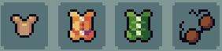

# Armours

## General Information
Armours in Mythfall are eqippable pieces of equipment which primarily grant players some [Guard]() points, and sometimes other stat boosts on top of that.

## Types of Armours
Currently, there are only four types of armours, with players being able craft two of them at the [Blacksmith]() in the [hub](), those being:
- [The Platebodies](./platebodies.md)
- [The Coconut Bra](./coconutBra.md)

Types of armour other than these two can only be obtained by beating the respective [Bosses]():
- [The Deceiduous Vest](./deciduousVest.md)
- [The Woodland Vest](./woodlandVest.md)
- [The Monk Robe](./monkRobe.md)
- [The Anubis Chainmail](./anubisChainmail.md)
- [The Demonic Corset](./demonicCorset.md)