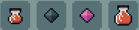

# Consumables

## General Information
Consumables, as the name implies, are one time use items, that, depending on their type, can either help a palyer to regain their health points or provide them with a permament boost to their stats.

## Types of Consumables
As it has been mentioned above, depending on the tyoe of benefit the consumable gives after being used, it falls into one of the following categories:
- [Potions](./potions/potions.md)
- [Stat Crystals](./statCrystals/statCrystals.md)

