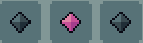

# Stat Crystals

## General characteristics
Stat Crystals are precious, end-game consumables, that allow the player to push the stats of their character, beyond the limits set by the levels.
All Stat Crystals have these features in common:
- Can only be obtained as a prize for either: 
	- Defeating a [World Boss]() and receiving one as a reward;
	- Completing a respective [dungeon](), with the difficulty of at least three skulls.
- Increase their coressponding stat by one point.
- Increase their corresponding stat, until they also hit the maximum value for their stat.

## Types of Stat Crystals
Currently, there are only three types of Stat Crystals, and depending on which stat the Stat Crystal increases, it falls into one of the following categories:
- [The Strength Crystals](./StCrystals.md)
- [The Vitality Crystals](./VCrystals.md)
- [The Speed Crystals](./SpCrystals.md)