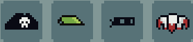

# Hats

## General Information
Hats in Mythfall are the most numerous and varied category of items as of now - they are equippable pieces of equpment that can grant the player various buffs, ranging from a flat stat increase to shooting an additional projectile when using a specific type of weapon.

## Types of Hats
Whilst most of the hats available in the game can only be obtained as a reward for beating [Bosses](), there are still a few hats that can be crafted by players at the [Blacksmith]() in the [Hub](), those include:
- [The Helmets](./helmets.md)
- [The Coconut Helmet](./coconutHelmet.md)

All other hats can only be obtained by beating the respective Bosses, those are:
- [The Captain' Hat](./captainsHat.md)
- [The Eyepatch](./eyepatch.md)
- [The Bycocket](./bycocket.md)
- [The Mohawk](./mohawk.md)
- [The Ninja Mask](./ninjaMask.md)
- [The Leafy Crown](./eafyCrown.md)
- [The Executioner's Hood](./xecutionersHood.md)
- [The Nightcap](./nightcap.md)
- [The Skull Mask](./skullMask.md)
- [The Jester Hat](./jesterHat.md)
- [The Broken Crown](./brokenCrown.md)
- [The Monk Hood](./monkHood.md)
- [The Nemes](./nemes.md)
