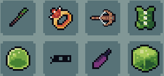

# Items
In the world of Mythfall there are numerous items that range in variety, from resources that can be used to upgrade one's gear to powerful weapons that can greatly help in defeating their foes.
All of them can be divided into seven seperate categories:

- [All items in the game](./all-items.md)
- [Resources](./resources.md)
- [Weapons](./weapons.md)
- [Hats](./hats.md)
- [Armours](./armours.md)
- [Rings](./rings.md)
- [Spell books](./spellbooks.md)
- [Consumables](./consumables.md)
- [Boots](./boots.md)