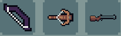

# Bows

## General Characteristics
Most weapons that fall into this category possess the following features:
- Shoot out multiple projectiles every attack.
- Have a rather small base damage per projectile.

## Types of Bows
Currently, players can only craft these types of bows:
- [The Normal Bows](./normalBows.md)
- [The Lorendel's Reach](./lorendelsReach.md)
- [The Chitin Crossbow](./chitinCrossbow.md)

All other bows can only be obtained as drops from [Bosses]().
Those include:
- [The Wooden Crossbow](./woodenCrossbow.md)
- [The Blunderbuss](./blunderbuss.md)