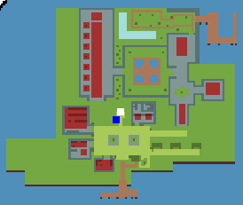
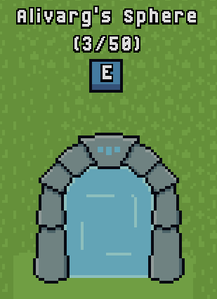

# Home
Home is where you start out. It's safe, and you restore Health and Mana. There are a number of useful locations (and some fun ones too!):

## Useful locations
### The Portal
The portal leads to [Alivarg's Sphere](./alivargs-sphere.md), where most of the game's action happens. It shows current players within.

### Librarian
The librarian allows you to trade [3 Ability pages](../items/abilities/abilities.md) for an Ability Book. It's also useful to look up where Ability Pages drop.

### Apothecary
The Apothecary allows you to upgrade your healing potions.

### Tailor
The tailor allows you to spend [Honor](../mechanics/honor.md) to change your appearance.

### Blacksmith
The blacksmith allows you to use crafting materials to create and upgrade your equipment.

## Fun locations
### Cats
A couple of cool cats are relaxing in the castle.

### Doris
Doris the nun warns you of the dangers of [The Portal](#the-portal)!

### Hall of Heroes
See which players accrued the most [Honor](../mechanics/honor.md) when they died!

### King
The king seems ... nice?

