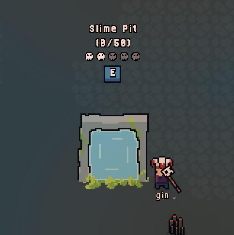

# Dungeons
Dungeons are a way to fight unique bosses and mobs, and are the primary way to get unique items.

## How do I find a dungeon?
Every time you kill a mob in the regular world (Alivarg's Sphere), you have a chance to trigger a portal drop.

> *Dungeons are randomly generated and feature multiple rooms leading to a boss fight.*

## Boss item drops
To be able to get a boss item drop, you need to do a minimum of **10%** of the damage to the boss's total health.