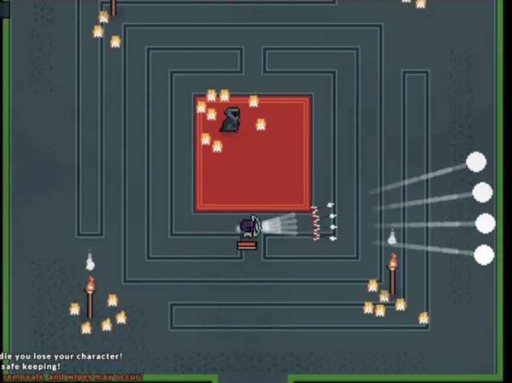
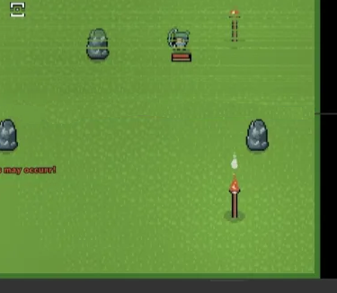

# Dungeons
Dungeons are a way to fight unique bosses and mobs, and are the primary way to get unique items.

## Contents
The list of contents present within this article:
- 1-[How do I find a dungeon?](#How-do-I-find-a-dungeon?)
- 2-[Dungeons' ranks](#Dungeons'-ranks)
- 3-[Dungeon's anotomy](#Dungeon's-anotomy)
	- 3.1-[Guaranteed Dungeon Rooms](#Guaranteed-Dungeon-Rooms)
	- 3.2-[Bonus Dungeon rooms](#Bonus-Dungeon-rooms)
	- 3.3-[Dungeon layout presets](#Dungeon-layout-presets)
	- 3.4-[Additional Dungeon Generation rules](#Additional-Dungeon-Generation-rules)
- 4-[Traversing a dungeon](#Traversing-a-dungeon)
- 5-[Boss item drops](#Boss-item-drops)
- 6-[Tips and some advice for exploring Dungeons](#Tips-and-some-advice-for-exploring-Dungeons)

## How do I find a dungeon?

An entrance portal to a dungeon may be triggered to spawn by either killing normal enemies inside of the Alivarg's sphere until one spawns, or killing a World Boss inside of the said sphere, which is guaranteed to spawn a portal upon its death - portals created by killing World Bosses always lead to much stronger dungeons. The said portal will disappear after a period of 4 minutes. The type of portal that spawns differs based on the mob killed and which area the mob is in.

> *Dungeons are randomly generated and feature multiple rooms leading to a boss fight. The amount of skulls indicates the difficulty of the dungeon.*

## Dungeons' ranks
Despite all dungeons being different from each other, they are all grouped up into difficuly ranks, which are displayed below a dungeon's name, and help Players with assessing the danger level - the more skulls a dungeon has, the harder it is.
Difficulty ranks range from 0 skulls, up to 5.
Here is a description of what can be expected to find in a dungeon of a specific rank:
- 0 skulls - The easiest ones. Enemies posses minuscule amounts of health, their shots are slow and far in between, and most of them only have one attack pattern. The bullets themselves are slim.. The dungeon itself is easy enough that someone with nothing but a stick who has already had some experience with bullet hells can clear it with only some difficulty. There are only two dungeons in this difficulty rank, namely the [Pirate Cove]() and the [Coolcrab Groto]() which can be considered to be more of tutorial dungeons than a proper ones.
- 1 skull - The dungeons for beginners. Enemies possess small amount of health, their shots are somewhat frequent, and they may use up to two attack patterns. The bullets themselves are either of normal size and normal speed or bigger, but slower, and always travel on a straight line (except for some bosses). The dungeon itself is a little more difficult, it is advised to equip gear of at least the same tier as the ores that can be obtained from the region the dungeon can be found in. In this difficulty rank, there are the following dungeons:
	- [The Eldertree Forest]();
	- [The Stoneheart Forest]().
- 2 skulls - The intermediate dungeons. Enemies possess ample health, their shots contain way more bullets, are more frequent, and they may use up to two attack patterns. The bullets themselves are of the standard size and shape and always travel in a straight line. The dungeon itself is much more difficult, there is a tangible danger of dying inside of it. It is advised to equip at least gold or chlorite tier gear and pieces of equipment received as rewards for beating one skull dungeons. An certain amount of skill is also advised. In this difficulty rank, there are the following dungeons:
	- [The Elvenwood Forest]();
	- [The Ancient Ruins]();
	- [The Alivarg's Tower]().
- 3 skulls - The advanced dungeons. Enemies possess high health, their shots contain less bullets, but are very frequent, and they may use up to two attack patterns. The bullets themselves are of the standard size and shape, and may form simple patterns (ex: orbitting one another). The dungeon itself is much more difficult, there is a high risk of dying inside of it. It is advised to equip your best gear as well as increase your stats with stat crystals a bit before attempting to beat it. You need to be skilled at the game to clear it - the equipment itself will no longer suffice. In this difficulty rank, there are the following dungeons:
	- [The Scorpion Pit]();
	- [The Anubis Temple]().
- 4 skulls - The expert dungeons. Enemies possess enormous amount health, their shots contain a lot of bullets and are very frequent, and they may use up to two attack patterns. The bullets themselves are of the standard size and shape, and may form intricate patterns, or home onto a player's position. The dungeon itself is incredibly difficult, you will most likely die inside of it at least once. It is advised to equip your best gear as well as increase your stats with stat crystals as much as you can before even thinking about beating it. You need to be highly skilled at the game to clear it - even a single mistake may lead to the demise of your character. In this difficulty rank, there are the following dungeons:
	- [The Grug Pit]();
	- [The Slime Pit]();
	- [The Hanging Temple]().
- 5 skulls - The Master dungeons. These are hard to describe as a category, because o this being the last dungeon rank, the difficulty of the dungeons within it greatly varies, depending on the biome the dungeon is native to. They are everything 4 skull dungeons were, but turned up to the very extreme - a fraction of a second of not paying attention can push your character to the brink of death. Most bosses incorporate projectiles inflicting status effects or tightly knot bullet patterns that make the dungeons that much more difficult. In this difficulty rank, there are the following dungeons:
	- [The Dwarven Mines]();
	- [The Volcanic Core]();
	- [The Succubus Lair]();
	- [The Necromancer's Garden]();
	- [The Chamber of the Awakened]().

## Dungeon's anotomy

### Guaranteed Dungeon Rooms
Each dungeon always contains the following rooms:

> *An example of a dungeon entrance room.*

- An entrance room, consisting of:
	- A teleport leading to this dungeon's entrance portal in the Alivarg's sphere;
	- At least one hallway exit leading to a combat room.

> *An example of a Combat room.*

- Each dungeon (excluding the ones with a boss fight layout preset) has a random amount of combat rooms, depending on the dungeon's generation preset, each one consisting of:
	- At least two hostile mobs;
	- At least one hallway exit leading to the next room, blocked off with a one-way barrier;
	- The further from the entrance a Combat room is positioned, the harder it is overall.

> *An example of a Boss room.*

- A Boss room, consisting of:
	- A Boss corresponding to the type of dungeon it is in;
	- At least one hallway exit leading to a combat room.
	
### Bonus Dungeon rooms
Each dungeon, additionally, has a high, but not guaranteed, chance to generate with one of the following rooms:

> *An example of a Shop room*
	
- A Dungeon Shop Room, with a crowman shopkeeper, in which :
	- All tiers of Healing Potions are being sold;
	- Onne random type of weapon of all tiers, up to obsidian is being sold;
	- The merchant sells items at a lower price and buys items at a higher one than the merchant in the hub;
	- The room itself has a high chance of appearing.

> *An example of a Treasure room.*
	
- A Treasure Room with an interactable fountain:
	- The fountain, upon being interacted with, spawns a treasure chest, that contains an item of random tier, ranging from a piece of driftwood, to a Paragon tier Ring;
	- The room has a small chance of appearing.
	

> *An example of a room with a Shadowy Figure within.*

- A room containg a Shodowy Figure - a provider of "Clandestine Services", where One can:
	- Swap their current Skill Point quest for another, rondom one, for a fee of 50 gold;
	- have their Record Expunged, allowing them to redistribute their skill points, for a fee of 250 gold;
	- Hire a Mercenary to instantly finish their current Skill Point quest, for a fee of 350 gold;
	- Have their Death Faked, allowing them to claim their character's honor points, without needing it to die, at the cost of 10 points of honor from their account.
	
<!-- We currently lack a photo of a Mine of better quality -->
>*An example of a room with a mine.*

- A Room containing multiple Ore nodes, in which:
	- The Ore Nodes can be destroyed to acquire multiple pieces of Ore.

### Dungeon layout presets
Each dungeon's layout is generated in accordance with its preset, resulting in different types of dungeon layouts.
The dungeon layout presets are as follows:

- Regular dungeons. The most common type of dungeon layout preset, consisting of:
	- From 10 to 18 Combat Rooms;
	- Multiple and, more often than not, long offshoot paths;
	- Up to one Bonus Room.
	
	This dungeon layout preset applies to the following dungeons:
	- [The Eldertree Forest]();
	- [The Stoneheart Forest]();
	- [The Elvenwood Forest]();
	- [The Ancient Ruins]();
	- [The Scorpion Pit]();
	- [The Anubis Temple]();
	- [The Grug Pit]();
	- [The Slime Pit]();
	- [The Hanging Temple]();
	- [The Dwarven Mines]();
	- [The Succubus Lair]();
	- [The Necromancer's Garden]();

- Prelude dungeons. This type of dungeon is mostly used for the very early game dungeons, or setting up the mood before a difficult boss fight. It consists of:
	- Exactly 5 Combat Rooms;
	- Little to none offshoot paths, that tend to be very short;
	- No Bonus rooms.
	
	This dungeon layout preset applies to the following dungeons:
	- [The Pirate Cove]();
	- [The Coolcrab Groto]();
	- [The Chamber of the Awakened]().

- Boss fight dungeons. The sole purpose of this dungeon layout preset is to house the aren for a fight against a difficult Boss. It consists of:
	- No Combat Rooms, and thus no offshoot paths;
	- No Bonus Rooms;
	- The Enterance Room is directly connected to the Boss Room.
	
	This dungeon layout preset applies to the following dungeons:
	- [The Alivarg's Tower]();
	- [The Volcanic Core]().

### Additional Dungeon Generation rules
Besides the previous points, there are some rules that govern the layout of each dungeon:
- The entirety of the dungeon is assembled from preexisting rooms.
- There is always at least one combat room between the entrance and the Boss room in each dungeon.
- Each room inside of a dungeon can be accessed normally (there are no disconnected rooms).
- Bonus Rooms may only generate connected to an offshoot path;
- Rooms are connected to other rooms via "paths" that override any walls that happen to be on top of them.
- The room layout is generated like a path, with the ends being the Enterance Room and the Boss Room, with possible offshoots that may not be longer than 3 rooms each.

	
	*1) A normal room*
	*2) A room with some of its features overridden by the "path"*

## Traversing a dungeon
Upon entering any dungeon, one is teleported to the entrance room of that dungeon.
The goal of each dungeon delve is to reach the Boss room and defeat the Boss located within it - it can only be reached by traversing and clearing the combat rooms lying in the way.
After clearing a combat room, the barrier to the next set of rooms will disapear and you will be able to enter the next room. Parties of multiple people will find the amount of health points of mobs in the rooms (including the Boss) increased by **50%** of their original health for each player inside that room.

> *Because the room barrier is still active players can not proceed until all mobs are defeated.*

After reaching the boss room, the Player or the Party is faced with a dangerous fight against that dungeon's Boss - surviving and defeating it is the only way to obtain the reward for clearing a dungeon.

## Boss item drops
After defeating the Boos, each player who contributed to defeating it receives their reward inside of a chest, which appears in the middle of the boss room and is only accessible by the respective player to prevent others from stealing their loot.
To be eligible to get a boss item drop, a player must fulfill the following conditions:
- Contribute to killing enemies within Combat Rooms;
- Visibly contribute to defeating the Dungeon's Boss;
- Deal at least a point of damage to the boss before a set amount of time since the start of the bossfight - the amount of time is unknown.
These conditions have been programed to stop player from practicing the culture of leeching, whereplayers used to take advantage od one player to do the brunt of the work, only to join at the very end to claim the rewards.

<!-- The following part of article may may not be - read as: "is not" - accurate, and will require further editting in the future. --> 
Each chest rewarded for defeating a Boss contains:
- Either a [health potion](../items/consumables.md) or a [jelly](../items/resources.md of a tier corresponding to the dungeon's rank, which is:
	- In case of Health Potions:
		- A [Small Health Potion](../items/consumables.md) for clearing at least a 0 skull dungeon;
		- A [Health Potion](../items/consumables.md) for clearing at least 2 skull dungeon;
		- A [Large Health Potion](../items/consumables.md) for clearing a dungeon with 4 or more skulls.
	- In case o Jellies:
		- An [Orange Jelly](../items/resources.md) for clearing a 0 skull dungeon;
		- A [Green Jelly](../items/resources.md) for clearing a 1 or more skull dungeon;
		- A [Blue Jelly](../items/resources.md) for clearing a dungeon with 3 or more skulls.
<!--	The amount of items from this category is equal to two, in case of the 5 skull dungeons. #I lack the knowledge whether it is still true, thus this part will be commented out. -->
- One of many unique pieces of equipment that can be obtained from that particular boss with varying chances, which:
	- are guaranteed from dungeons with **less** than 3 skulls, but may be replaced with a piece of ore, whose type varies from dungeon to dungeon, if one is unlucky enough;
	- have a 10% chance of appearing in dungeons with 2 or more skulls, in which case they are replaced by a resource.
	- The common resource is replaced by a stat crystal in case of dungeons that happen to drop one, which are as follows:
		- [The Ancient Ruins]();
		- [The Alivarg's Tower]();
		- [The Anubis Temple]();
		- [The Hanging Temple]();
		- [The Dwarven Mines]();
		- [The Succubus Lair]();
		- [The Necromancer's Garden]();
		- [The Chamber of the Awakened]().
- A common reward, which tier is dependant on the skull rank of the biome the dungeon is found in, which may be:
	- A common crafting resource;
	- A piece of equipment that can be crafted with common resources;
	- A Stat Ring.

## Tips and some advice for exploring Dungeons
Dungeons, by nature, are incredibly dangerous places that may vanquish anyone not prepared enough to conquer them.
Fortunately, there are some tricks that might just save you on your next dungeon delve, as well as spare you the unnecessary anxiousness.

- **Extra healing** - No matter whether one is trying to conquer a completely new dungeon, or is doing the 100th run of the same one, one should always carry some healing in a case of an emergency - accidents do happen, and that extra healing might just save your life.
- **Retreating** - Whenever one is in a dungeon and has little health left, they should ask themselves whether they are able to keep going and beat the Boss, and more importantly, wthether it is worth the risk of losing their equipment and stats - don't be afraid of retreating, once you return, you'll be stronger than before, and will be able to clear it more easily.
- **Watching one's health** - Whenever one is engaged in combat, they should always be mindful of the state of their health, as even a single moment of distraction might prove fatal - you should always be ready to heal yourself in case of an emergency, and it is also reasonable to recall mid-fight if you can only take a couple more hits, as recalling later might simply prove no longer possible.
- **Exploring new dungeons** - If one wants to attempt to clear a dungeon that they haven't beaten before, it is advised for them to equip their best gear with as much defence as possible, and bring as many potions as they can. Taking a [Book of Stone](../..items/abilities/bookOStone.md) is also a great idea, as it can provide invalueable shielding while retreating - it really is better to be safe than sorry.
- **Room scouting** - Room scouting might prove invalueable wile one is exploring the more difficult dungeons, as it allows one to avoid the risk of entering a combat room that is essentially a dead end and losing some priceless health points, as well as reaching the Boss room itself faster. It is more of a strategy of clearing dungeons than just simple advice - it relies on:
	- **Scouting for dead ends**: The minimap gives a wider view of the surrounding area, even in dungeons - by carefully approaching the next room's barrier, but not entering it, allows one to see on the minimap whether it leads further or is just a dead end, which can be told apart by:
		- A: A hole in the opposite wall of the room;
		- B: Absence or deformation of one of the room's characteristic features that has been overridden by the beforementioned "path" that leads to the next room.
	  If the minimap can't show the entirety of the room, and the room doesn't contain any walls in the middle that could've been overridden, the room might still contain a hallway to the next one, but it is better to check the others first.
	- **Optimising exploration** - The order one chooses the rooms they explore should suit their needs - if you want to reach the Boss quickly, you ought to choose the room with the highest amount of hallways, but if you desire to preserve your health for later, it is advised you explore the ones with the least amount of enemies, or ones that are easy to handle (the explored room should still have a hallway to the next one).
	- **Scouting for Boss rooms** - Each type of dungeon has a Boss room that is distinct from any other Combat room in shape and sometimes size - being able to spot them on the minimap can help with deciding which rooms to explore which results in faster exploration overall.

## Credits
The list of people who contributed to the contents of this article:
- "Fridge", who contributed the photo of the Room with the Shadowy Figure within and a Mine.